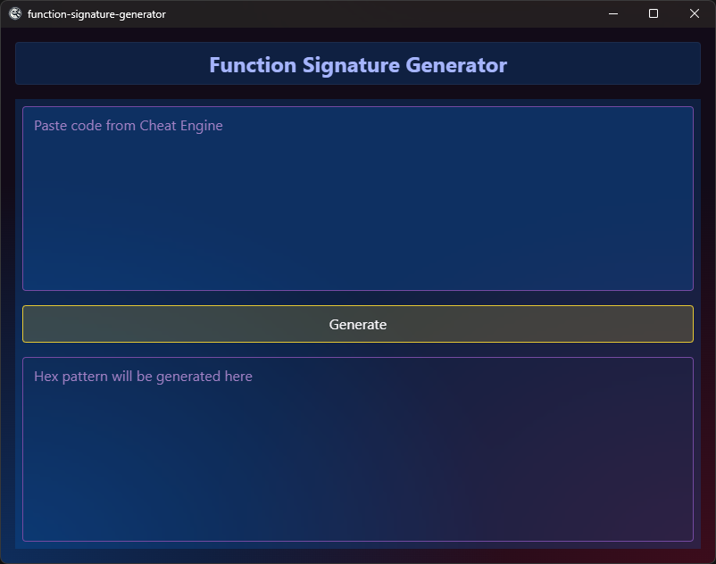
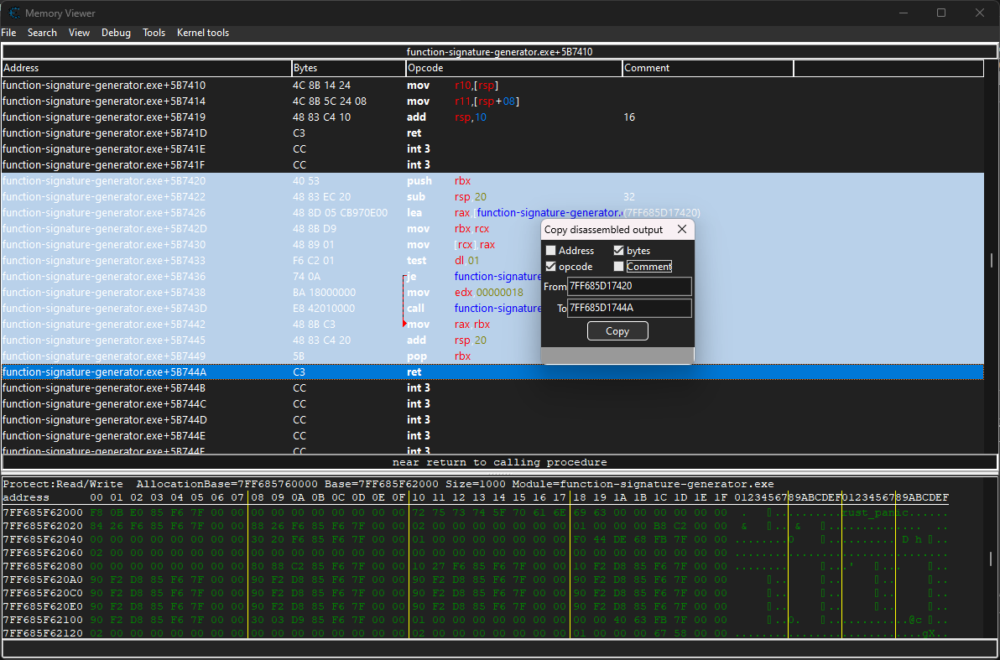
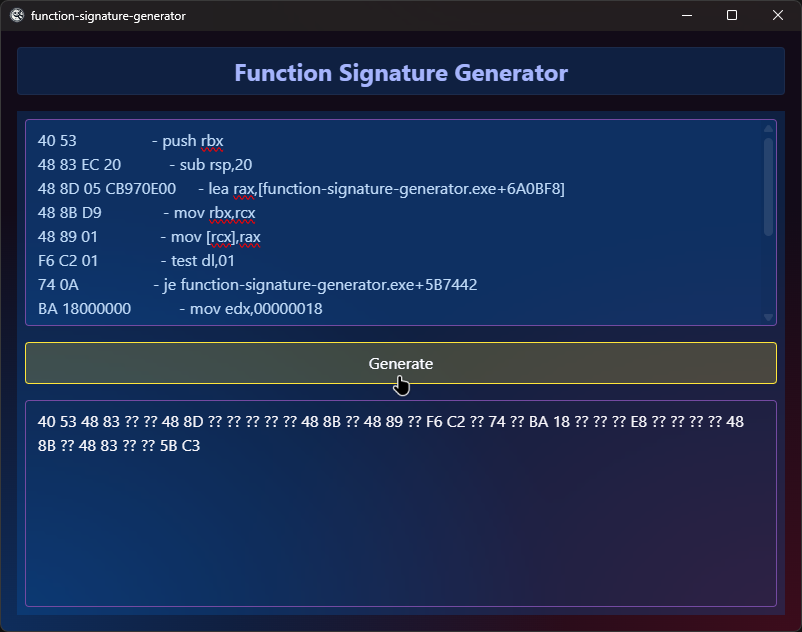

# function-signature-generator
Generate function signature by given code from Cheat Engine.

The generated hex pattern can be used with `AOBScan` in Cheat Engine to locate the desired address in memory.

  

    
    
    
  

